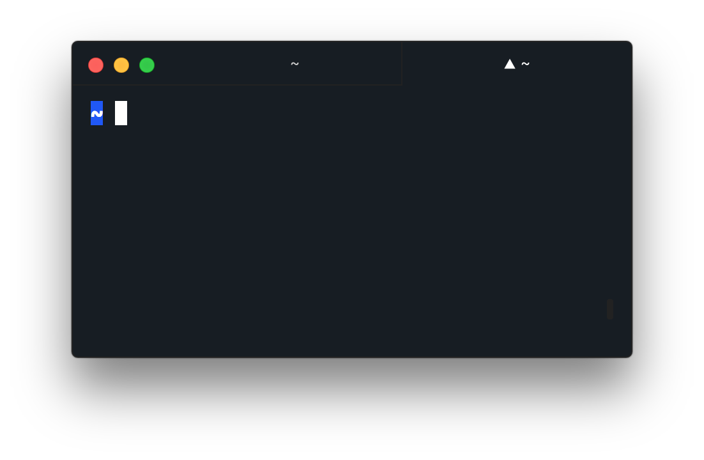
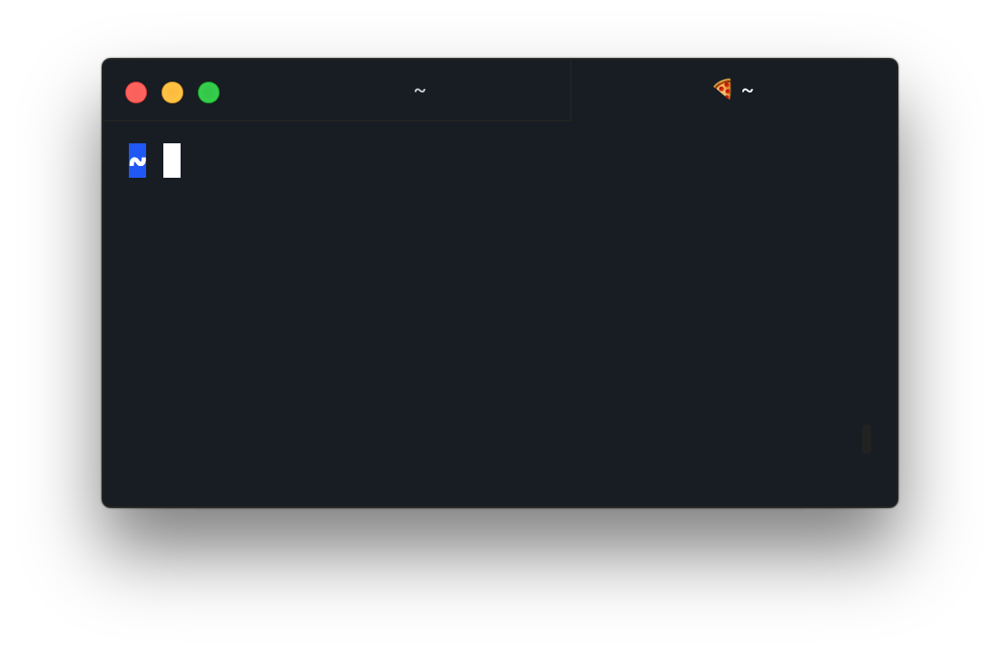
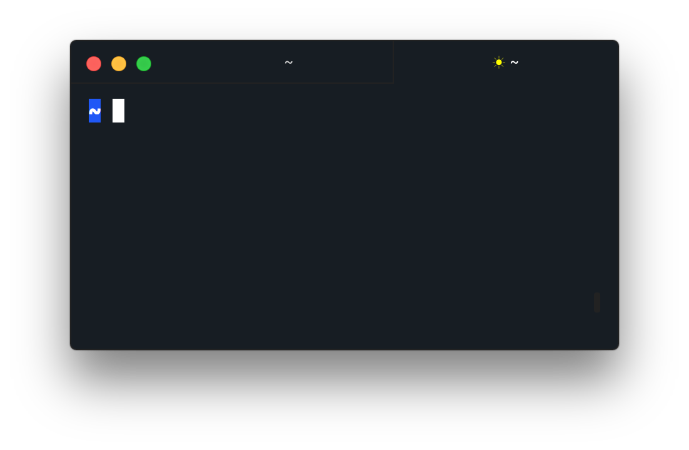

## hyper-active-tab

Add a symbol to the `▲ active tab` in your hyper terminal.

* Simple configuration in `.hyper.js`
* Compatible with any theme

<div align="center">
<p>

</p>
</div>

### Install

`hyper i hyper-active-tab`

### Configure symbol

Add a line to your hyper configuration (`~/.hyper.js`) :

```js
module.exports = {
  config: {
    // rest of the config
    activeTab: '🍕'
  }
  // rest of the file
}
```

<div align="center">
<p>

</p>
</div>

### Configure symbol and color

```js
module.exports = {
  config: {
    // rest of the config
    activeTab: {
      symbol: '☀︎',
      color: 'yellow'
    }
  }
  // rest of the file
}
```

<div align="center">
<p>

</p>
</div>
